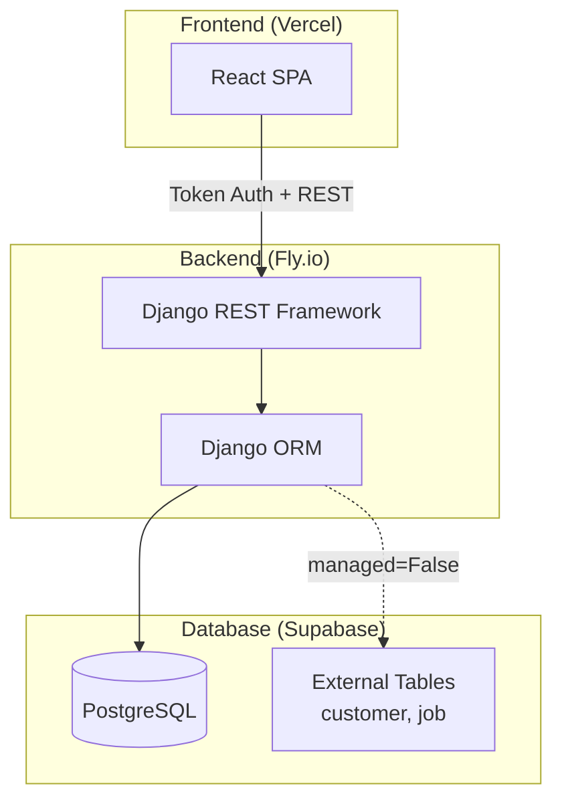
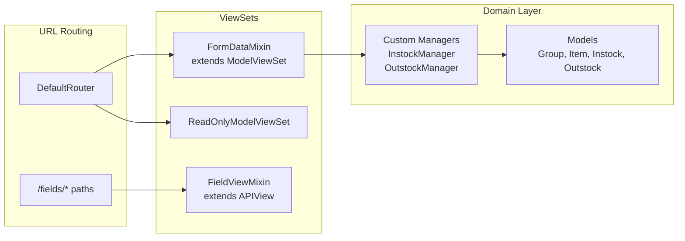
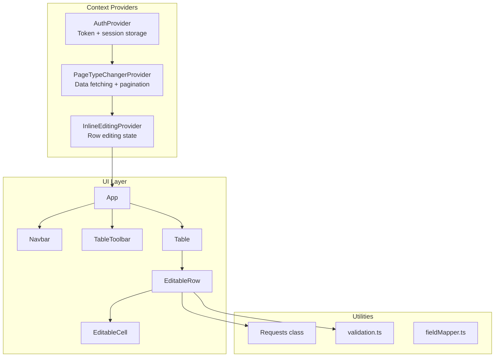
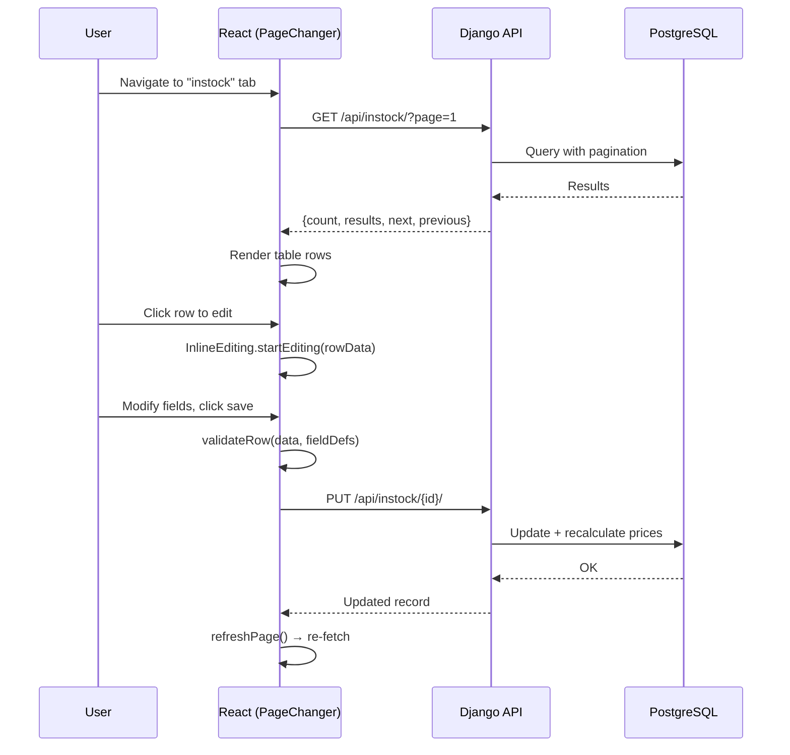
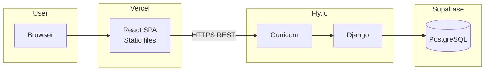

# Architecture

## System Overview

## Architecture Style

**Client-server REST** — Single-page React app communicates with a Django REST API. No server-side rendering. Frontend and backend deployed independently.

## Backend Architecture

### Key Design Decisions

1. **Custom ViewSet base (`FormDataMixin`)** — Extends `ModelViewSet` with:
   - Automatic related-key resolution (nested objects → IDs before save)
   - Separate serializers for read vs write vs export
   - CSV export action
   - Pagination via DRF's `PageNumberPagination`

2. **Field metadata API (`FieldViewMixin`)** — Serves model field definitions (name, type, choices, required) so the frontend dynamically builds forms/tables without hardcoding fields.

3. **Business logic in Managers** — `InstockManager` and `OutstockManager` encapsulate transactional stock operations (quantity adjustment, price recalculation) using `@transaction.atomic`.

4. **Unmanaged models** — `Customer` and `Job` map to pre-existing external database tables (`managed = False`). Django doesn't create/migrate these tables.

## Frontend Architecture

### Frontend Design Decisions

1. **Context-based state** — No Redux/Zustand. Three React context providers manage all global state:
   - `AuthProvider` — token storage, auth headers, login/logout
   - `PageTypeChangerProvider` — current page, data fetching, search, pagination
   - `InlineEditingProvider` — edit/create mode, field state, validation, save

2. **Custom HTTP class (`Requests`)** — Static methods wrapping native `fetch`. Throws typed `RequestError` with status + response data. No Axios at runtime despite being listed historically.

3. **Dynamic table rendering** — Table columns and editable cells are generated from API field metadata (`/fields/*` endpoints), not hardcoded per model.

4. **Inline editing** — Click a row to edit in-place. No modal forms for CRUD. New rows appear at top of table.

## Data Flow

## Deployment Topology

- **Frontend**: Static build on Vercel with environment-specific API URL
- **Backend**: Fly.io with auto-stop (free tier), migrations run via `release_command`
- **Database**: Supabase-managed PostgreSQL
- **Auth flow**: POST `/login/` → receive token → include `Authorization: Token <token>` on all API calls
