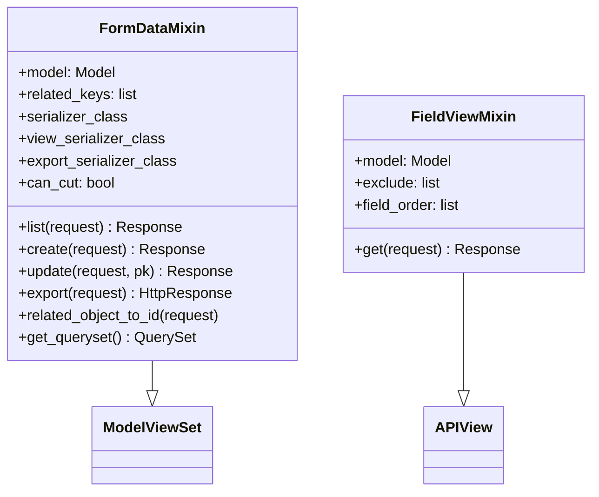
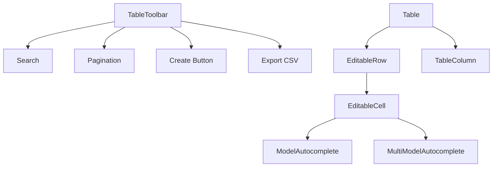

# Components

## Backend Components

### `stockmanagement` App (Main Domain)

The core Django app containing all inventory domain logic.

| Component | File | Responsibility |
|-----------|------|----------------|
| Models | `models.py` | Domain entities (Group, Brand, Item, Instock, Outstock, Customer, Job) + custom managers with transactional business logic |
| Views | `views.py` | DRF ViewSets for each model — CRUD, search, filtering, stock quantity management |
| Serializers | `serializers.py` | Read/write/export serializer variants per model. `FlexibleForeignKeyField` for PK or slug lookup |
| URLs | `urls.py` | DefaultRouter registration + field metadata paths + Cypress test helpers |
| Custom ViewSets | `util/custom_viewsets.py` | `FormDataMixin` (CRUD base) and `FieldViewMixin` (field metadata API) |
| Data Import | `util/load_data_excel.py` | Excel import logic with caching, progress tracking, batch processing |
| Cypress Helpers | `cypress_helpers.py` | Test data creation/deletion endpoints for E2E tests |

### `login` App

| Component | File | Responsibility |
|-----------|------|----------------|
| Views | `views.py` | `TokenAuthentication` — POST endpoint returning auth token |
| Serializers | `serializers.py` | `UserSerializer` for user data |
| URLs | `urls.py` | Login endpoint routing |

### Management Commands

| Command | File | Responsibility |
|---------|------|----------------|
| `loadstock` | `stockmanagement_bg/management/commands/loadstock.py` | Import stock data from Excel files |
| `createsu` | `stockmanagement_bg/management/commands/createsu.py` | Create superuser from environment variables |
| `reset_django_tables` | `stockmanagement/management/commands/reset_django_tables.py` | Backup DB + truncate managed tables |

### `FormDataMixin` — Custom ViewSet Base



Key behaviors:
- `related_object_to_id()` — transforms nested objects `{id: 5, name: "..."}` to bare IDs before DRF validation
- Separate serializer for read (`view_serializer_class`), write (`serializer_class`), and export (`export_serializer_class`)
- `export` action generates CSV with filtered/searched data

### `FieldViewMixin` — Dynamic Field Metadata

Introspects Django model fields and returns:
```json
[
  {"fieldName": "code", "fieldType": "CharField", "fieldChoices": null, "required": true},
  {"fieldName": "group", "fieldType": "ForeignKey", "fieldChoices": null, "required": false},
  {"fieldName": "store_type", "fieldType": "ChoiceField", "fieldChoices": ["metal", "accessory", "machine", "service"], "required": true}
]
```

Frontend uses this to dynamically render form inputs and determine field types for editing.

---

## Frontend Components

### Context Providers

| Provider | File | Responsibility |
|----------|------|----------------|
| `AuthProvider` | `context/Login.tsx` | Token storage (sessionStorage), auth headers, sign-in/sign-out, `RequireAuth` route guard |
| `PageTypeChangerProvider` | `context/PageChanger.tsx` | Current page name, data fetching, search term, pagination state, page navigation |
| `InlineEditingProvider` | `context/InlineEditingContext.tsx` | Edit/create mode, editing data, field validation, save (POST/PUT), cancel, move-to-outstock |

### Page Components

| Component | File | Responsibility |
|-----------|------|----------------|
| `App` | `pages/App.tsx` | Root layout — Navbar + InlineEditingProvider + TableToolbar + Table |
| `Navbar` | `pages/Navbar.tsx` | Tab navigation between pages (instock, outstock, item, group) |
| `Login` | `context/Login.tsx` | MUI login form with error display |
| `ExpandButton` | `pages/ExpandButton.tsx` | Icon button that expands to show text on hover |
| `Logo` | `pages/Logo.tsx` | App logo |
| `Shapes` | `pages/Shapes.tsx` | SVG tag/pill shape components (UI decorations) |

### Table System



| Component | File | Responsibility |
|-----------|------|----------------|
| `Table` | `table/Table.tsx` | Renders header + body rows, handles row click → edit, computed columns (Total Price) |
| `TableToolbar` | `table/TableToolbar.tsx` | Search, create button, export CSV, pagination controls |
| `EditableRow` | `table/EditableRow.tsx` | Renders editable cells for a row being edited/created, save/cancel buttons |
| `EditableCell` | `table/EditableCell.tsx` | Renders appropriate input control based on field type (text, number, date, select, autocomplete) |
| `ModelAutocomplete` | `table/ModelAutocomplete.tsx` | Searchable dropdown for FK fields — fetches options from API with debounce |
| `MultiModelAutocomplete` | `table/MultiModelAutocomplete.tsx` | Multi-select autocomplete for M2M fields (e.g., Job) |
| `Search` | `table/Search.tsx` | Search input with debounced text filtering |
| `Pagination` | `table/Pagination.tsx` | Page number buttons, prev/next navigation |
| `LoadingSpinner` | `table/LoadingSpinner.tsx` | SVG spinner |

### Utilities

| Utility | File | Responsibility |
|---------|------|----------------|
| `Requests` | `util/requests.tsx` | Static HTTP methods (get/post/put/delete) wrapping fetch, throws `RequestError` |
| `validation` | `util/validation.ts` | `validateRow()` — client-side field validation; `mapServerErrors()` — transforms API 400 responses |
| `fieldMapper` | `util/fieldMapper.ts` | Maps field metadata types to UI control types |
| `keyboardNavigation` | `util/keyboardNavigation.ts` | Keyboard event → navigation action mapping |
| `moveToOutstock` | `util/moveToOutstock.ts` | Extracts fields from instock row to pre-fill outstock creation |
| `strings` | `util/strings.tsx` | `title()`, `formatDate()`, `formatDateString()` |
| `constants` | `util/constants.tsx` | `EXCLUDED_MODELS` set (pages without inline editing) |

### Custom Hooks

| Hook | File | Responsibility |
|------|------|----------------|
| `usePagination` | `customhooks/PageNumberDisplayHook.tsx` | Page number display array, hasNext/hasPrevious state |
| `usePageNumberUpdater` | `customhooks/PageUpdateHook.tsx` | Current page number state + navigation functions |
