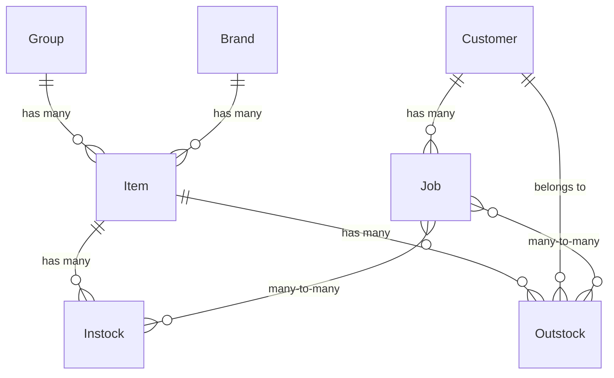

# Data Models

## Entity Relationship Diagram

## Models

### Group

Category for organizing items.

| Field | Type | Constraints | Description |
|-------|------|-------------|-------------|
| id | AutoField | PK | Auto-generated |
| name | CharField(50) | required | Group name |
| description | CharField(200) | required | Group description |
| modified | DateTimeField | auto_now | Last modification timestamp |

**Search fields**: `name`

---

### Brand

Item manufacturer/brand.

| Field | Type | Constraints | Description |
|-------|------|-------------|-------------|
| id | AutoField | PK | Auto-generated |
| name | CharField(50) | required | Brand name |
| modified | DateTimeField | auto_now | Last modification timestamp |

---

### Item

Stock-keeping unit — the central entity.

| Field | Type | Constraints | Description |
|-------|------|-------------|-------------|
| id | AutoField | PK | Auto-generated |
| code | CharField(50) | unique, required | SKU code (e.g., "GL2020") |
| description | CharField(1000) | required | Item description |
| brand | ForeignKey(Brand) | nullable, SET_NULL | Manufacturer |
| unit | CharField(50) | nullable | Unit of measurement |
| group | ForeignKey(Group) | nullable, SET_NULL | Category |
| quantity | DecimalField(50,2) | default=0 | Current stock level |
| instock_number | IntegerField | default=0 | Total instock record count |
| outstock_number | IntegerField | default=0 | Total outstock record count |
| max_price | DecimalField(50,2) | nullable | Highest unit price across all instocks |
| min_price | DecimalField(50,2) | nullable | Lowest unit price across all instocks |
| sum_price | DecimalField(50,2) | default=0 | Sum of (price × quantity) across all instocks |
| min_quanity | DecimalField(50,2) | nullable | Alert threshold — low stock |
| max_quanity | DecimalField(50,2) | nullable | Alert threshold — overstock |
| notes | CharField(1000) | nullable, blank | Free-text notes |
| modified | DateTimeField | auto_now | Last modification timestamp |

**Search fields**: `code`, `max_price`, `min_price`, `sum_price`  
**Number fields**: `weight`, `max_price`, `min_price`, `sum_price`  
**Computed**: `get_average_price()` → `sum_price / instock_number`

---

### Stock (Abstract Base)

Base class for Instock and Outstock — never instantiated directly.

| Field | Type | Constraints | Description |
|-------|------|-------------|-------------|
| stock_date | DateField | default=now, nullable | Transaction date |
| created_date | DateTimeField | auto_now_add | Record creation timestamp |
| modified | DateTimeField | auto_now | Last modification timestamp |
| item | ForeignKey(Item) | nullable, SET_NULL | Associated item |
| quantity | DecimalField(50,2) | MinValue(0) | Quantity transacted |
| notes | CharField(1000) | nullable, blank | Free-text notes |
| store_type | CharField(20) | choices, default="metal" | Store category |

**StoreType choices**: `metal`, `accessory`, `machine`, `service`

---

### Instock

Record of items received into inventory. Extends `Stock`.

| Field | Type | Constraints | Description |
|-------|------|-------------|-------------|
| id | AutoField | PK | Auto-generated |
| invoice_id | CharField(50) | required, default="UNDEFINED" | Invoice reference |
| job | ManyToManyField(Job) | | Associated jobs |
| price | DecimalField(50,2) | nullable, MinValue(0) | Unit price paid |
| purchase_order_id | CharField(50) | nullable | PO reference |
| supplier | CharField(50) | nullable | Supplier name |
| *(inherited Stock fields)* | | | |

**Search fields**: `job_id`, `invoice_id`, `purchase_order_id`, `supplier`, `quantity`, `price`  
**Manager**: `InstockManager`

---

### Outstock

Record of items withdrawn from inventory. Extends `Stock`.

| Field | Type | Constraints | Description |
|-------|------|-------------|-------------|
| id | AutoField | PK | Auto-generated |
| stock_id | CharField(200) | nullable | Stock reference ID |
| requester | CharField(200) | required | Person requesting withdrawal |
| department | CharField(200) | nullable | Requesting department |
| remaining_quantity | DecimalField(50,2) | nullable, MinValue(0) | Item quantity remaining after withdrawal |
| job | ManyToManyField(Job) | | Associated jobs |
| customer | ForeignKey(Customer) | nullable, blank, SET_NULL | Customer for this withdrawal |
| *(inherited Stock fields)* | | | |

**Search fields**: `stock_id`, `requester`, `department`, `quantity`  
**Manager**: `OutstockManager`

---

### Customer (Unmanaged)

External database table — Django does not manage migrations.

| Field | Type | Constraints | Description |
|-------|------|-------------|-------------|
| id | AutoField | PK | Auto-generated |
| name | CharField(50) | required | Customer name |

**DB table**: `customer`  
**managed**: `False`

---

### Job (Unmanaged)

External database table — Django does not manage migrations.

| Field | Type | Constraints | Description |
|-------|------|-------------|-------------|
| job_id | CharField(50) | PK | Job identifier (natural key) |
| customer | ForeignKey(Customer) | nullable, SET_NULL | Associated customer |

**DB table**: `job`  
**managed**: `False`

---

## Custom Managers

### StockManager (Base)

Shared logic for both Instock and Outstock managers:

| Method | Behavior |
|--------|----------|
| `set_model_attributes(stock, attributes)` | Bulk-set attributes + `full_clean()` validation |
| `update_quantity(item, quantity)` | Adjusts `item.quantity` by delta |
| `reset_sum(instock)` | Reverses price contribution of an instock record |
| `reset_price(instock)` | Recalculates `max_price`/`min_price` from remaining instocks |

### InstockManager

| Method | Behavior |
|--------|----------|
| `create_instock(**kwargs)` | `@transaction.atomic` — creates record, updates item quantity, instock_number, sum/min/max prices |
| `update_instock_number(item)` | Increments `item.instock_number` |
| `update_sum_price(current_price)` | Adds to `item.sum_price` |
| `update_min_price(unit_price)` | Updates if new price is lower |
| `update_max_price(unit_price)` | Updates if new price is higher |
| `calculate_total_item_price(unit_price, qty)` | `round(unit_price * qty, 2)` |

### OutstockManager

| Method | Behavior |
|--------|----------|
| `create_outstock(**kwargs)` | `@transaction.atomic` — validates quantity available, creates record, decrements item quantity, increments outstock_number, records remaining_quantity |
| `update_outstock(**kwargs)` | `@transaction.atomic` — reverses old quantities, validates new quantity, applies changes |
| `validate_quantity(quantity)` | Raises `ValidationError` if quantity ≤ 0 or exceeds available stock |
| `update_outstock_number(item, increment)` | Adjusts `item.outstock_number` |

---

## Business Rules Enforced by Models/Managers

1. **Outstock cannot exceed available quantity** — `OutstockManager.validate_quantity()` checks `item.quantity >= requested`
2. **Price aggregates auto-update** — On instock create, `sum_price`, `min_price`, `max_price` are recalculated
3. **Quantity auto-adjusts** — Instock adds to `item.quantity`; Outstock subtracts
4. **All stock ops are atomic** — `@transaction.atomic` ensures consistency on failure
5. **Outstock tracks remaining** — `remaining_quantity` snapshot stored at withdrawal time
6. **Flexible FK input** — `FlexibleForeignKeyField` accepts either PK (int) or name (string) for lookups
