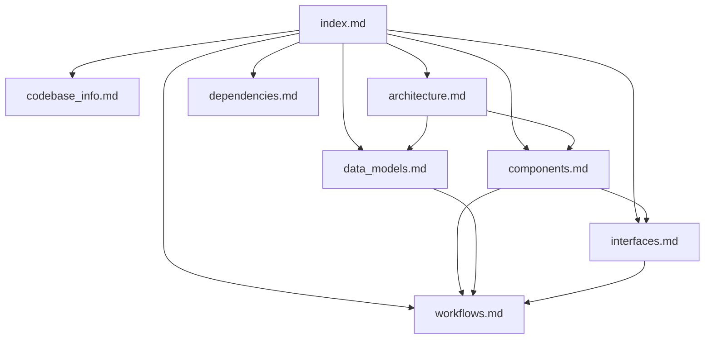

# Documentation Index

## How to Use This Knowledge Base

This index is the **primary entry point** for AI assistants working with the PC Elemac Stock Management System. Read this file first — it contains enough metadata to determine which detailed file to consult for any question.

### Navigation Strategy

1. **Start here** — scan the file summaries below to identify relevant documents
2. **Drill down** — read the specific file(s) that match your question
3. **Cross-reference** — use the relationship map to find connected concerns

## File Index

| File | Purpose | Consult When... |
|------|---------|-----------------|
| `codebase_info.md` | Project overview, tech stack, directory layout, config files | Need basic project facts, directory paths, or tech choices |
| `architecture.md` | System design, patterns, data flow, deployment topology | Need to understand how components connect, why something is structured a certain way |
| `components.md` | Major components, their responsibilities, and boundaries | Need to find where specific functionality lives, what a module does |
| `interfaces.md` | API endpoints, request/response formats, field metadata API | Need endpoint details, payload shapes, auth requirements |
| `data_models.md` | Django models, relationships, field details, managers | Need to understand data structure, model behavior, business rules in models |
| `workflows.md` | Key processes: instock creation, outstock validation, inline editing, page navigation | Need to understand multi-step operations, state transitions |
| `dependencies.md` | External packages, their roles, version constraints | Need to know what's installed, why, or find alternatives |
| `review_notes.md` | Documentation gaps, inconsistencies, improvement suggestions | Need to know what's incomplete or uncertain |

## Document Relationships

## Quick Reference

### Backend Entry Points
- **API Router**: `stockmanagement_bg/stockmanagement/urls.py` — all REST endpoints registered here
- **Models**: `stockmanagement_bg/stockmanagement/models.py` — domain entities + business logic in managers
- **Views**: `stockmanagement_bg/stockmanagement/views.py` — ViewSet definitions
- **Custom ViewSets**: `stockmanagement_bg/stockmanagement/util/custom_viewsets.py` — `FormDataMixin` and `FieldViewMixin`
- **Settings**: `stockmanagement_bg/stockmanagement_bg/settings.py`

### Frontend Entry Points
- **App Root**: `stockmanagement-fe/src/pages/App.tsx`
- **State Management**: `stockmanagement-fe/src/pages/context/` — PageChanger, InlineEditing, Login providers
- **API Layer**: `stockmanagement-fe/src/util/requests.tsx` — `Requests` class
- **Table System**: `stockmanagement-fe/src/pages/table/` — Table, EditableRow, EditableCell, Search, Pagination
- **Types**: `stockmanagement-fe/src/util/types/PageTypes.tsx`

### Key Patterns
- **Backend CRUD**: `FormDataMixin` extends `ModelViewSet` with related-key resolution, CSV export, field metadata
- **Field Metadata**: `FieldViewMixin` serves model field definitions to frontend for dynamic form/table generation
- **Stock Operations**: `InstockManager`/`OutstockManager` use `@transaction.atomic` for quantity/price consistency
- **Frontend State**: Context providers (no Redux) — `PageChanger` for data fetching/pagination, `InlineEditing` for row editing
- **Inline Editing**: Click row → edit in-place → validate → save via PUT/POST → refresh
