# Workflows

## 1. Authentication Flow

```mermaid
sequenceDiagram
    participant User
    participant LoginPage as Login Page
    participant API as POST /login/
    participant Session as sessionStorage
    
    User->>LoginPage: Enter username + password
    LoginPage->>API: POST {username, password}
    alt Valid credentials
        API-->>LoginPage: {token, username}
        LoginPage->>Session: Store token
        LoginPage->>LoginPage: Generate auth header
        LoginPage->>User: Redirect to saved path (or "/")
    else Invalid credentials
        API-->>LoginPage: 400 {non_field_errors: [...]}
        LoginPage->>User: Display error messages
    end
```

**Key details:**
- Token stored in `sessionStorage` (cleared on tab close)
- `RequireAuth` component guards all routes — redirects to `/login` if no token
- Auth header constructed as `{Authorization: "Token <token>"}` via `useRef` (avoids re-renders)
- `clearToken()` removes from storage and forces page reload

---

## 2. Page Navigation + Data Loading

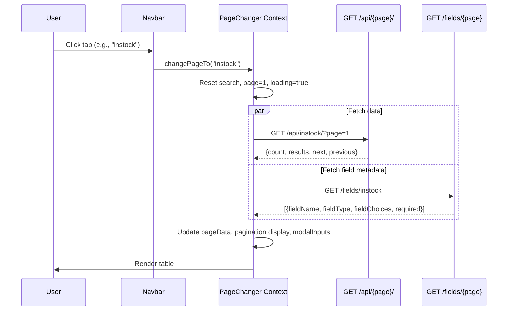

**State managed by `PageTypeChangerProvider`:**
- `currentPageName` — which resource is shown
- `pageData` — current page results array
- `modalInputs` — field metadata for current page
- `searchTerm` — current search filter
- `currentPageNumber` — pagination state
- `pageDisplay` — page number buttons, hasNext/hasPrevious

---

## 3. Search Flow

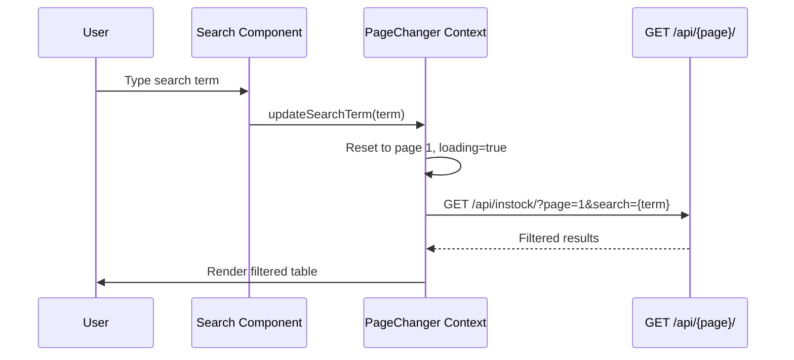

**Backend behavior:**
- DRF `SearchFilter` performs case-insensitive `icontains` across configured `search_fields`
- Related fields searched via `__` lookups (e.g., `item__code`, `group__name`)
- Combined with `DjangoFilterBackend` for numeric/date range filters

---

## 4. Inline Editing Flow

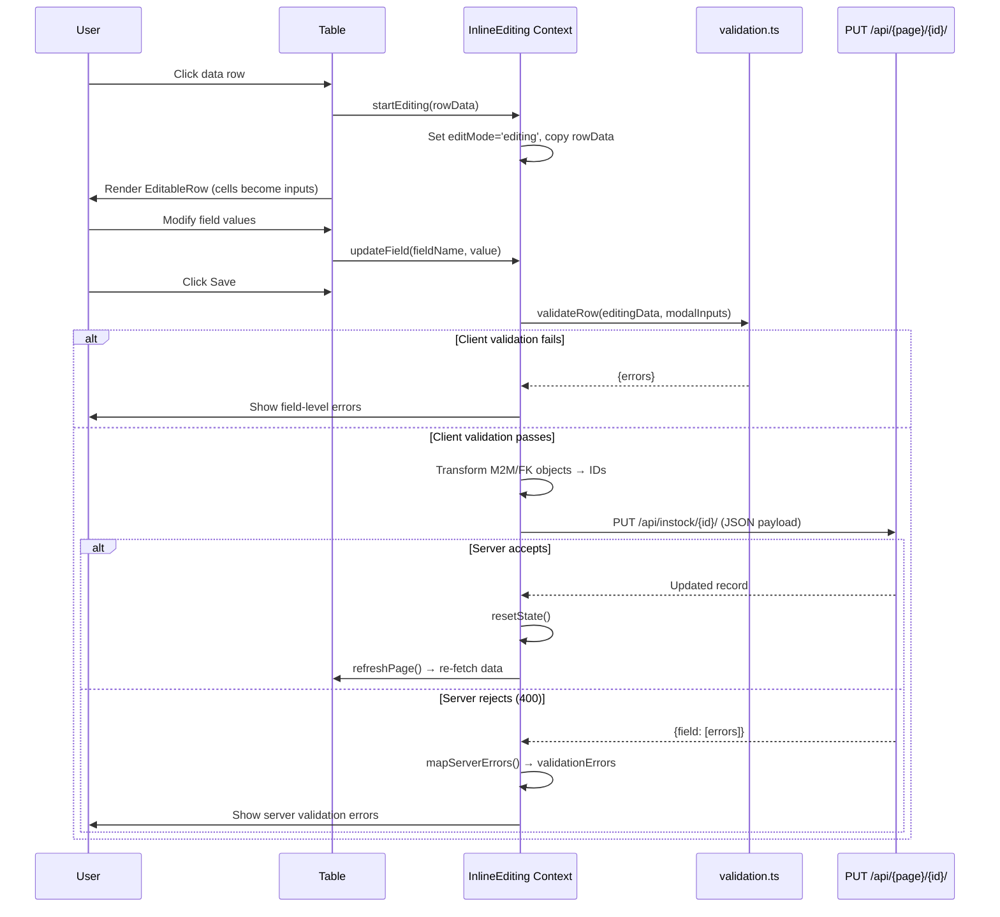

---

## 5. Inline Creation Flow

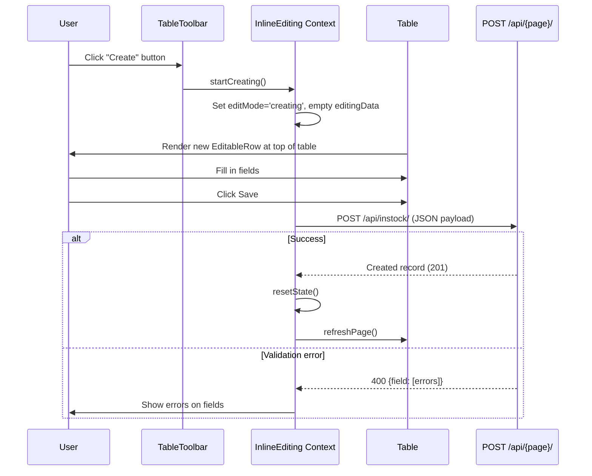

---

## 6. Instock Creation (Backend Business Logic)

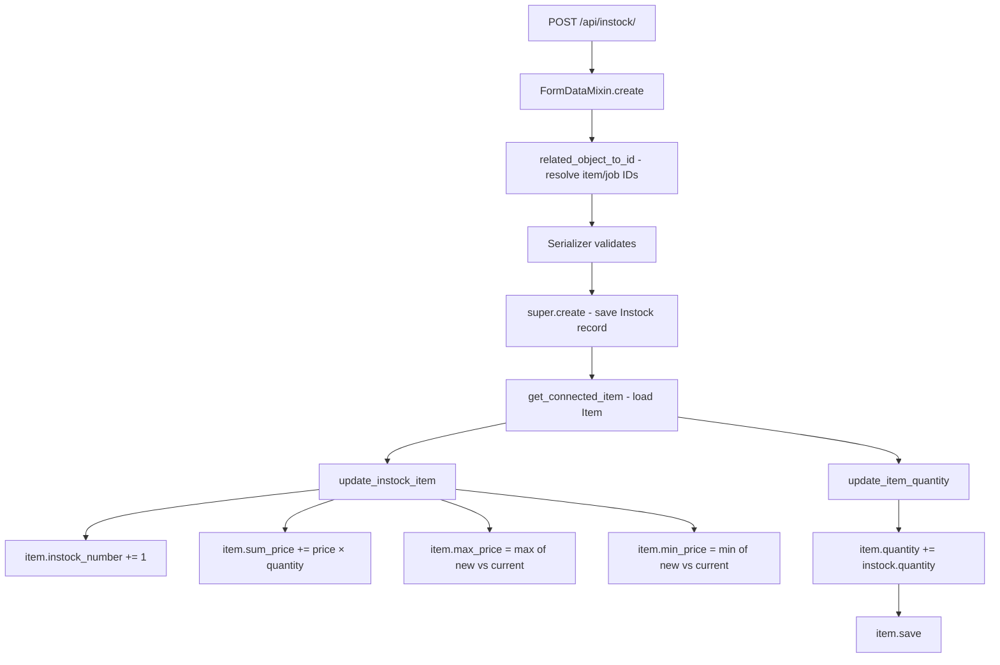

---

## 7. Outstock Creation (Backend Business Logic)

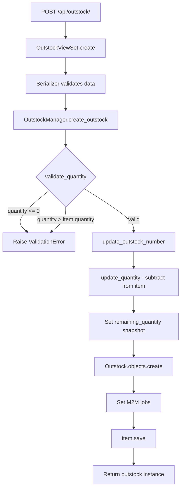

**Critical constraint**: All inside `@transaction.atomic` — if any step fails, everything rolls back.

---

## 8. Move to Outstock (Instock → Outstock Shortcut)

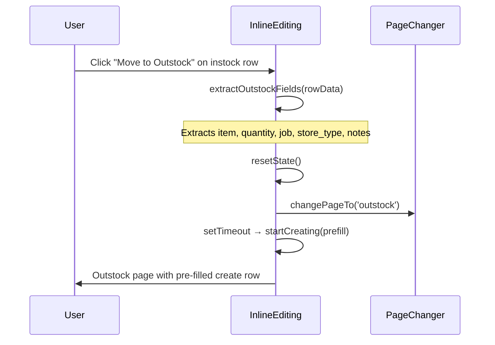

---

## 9. CSV Export Flow

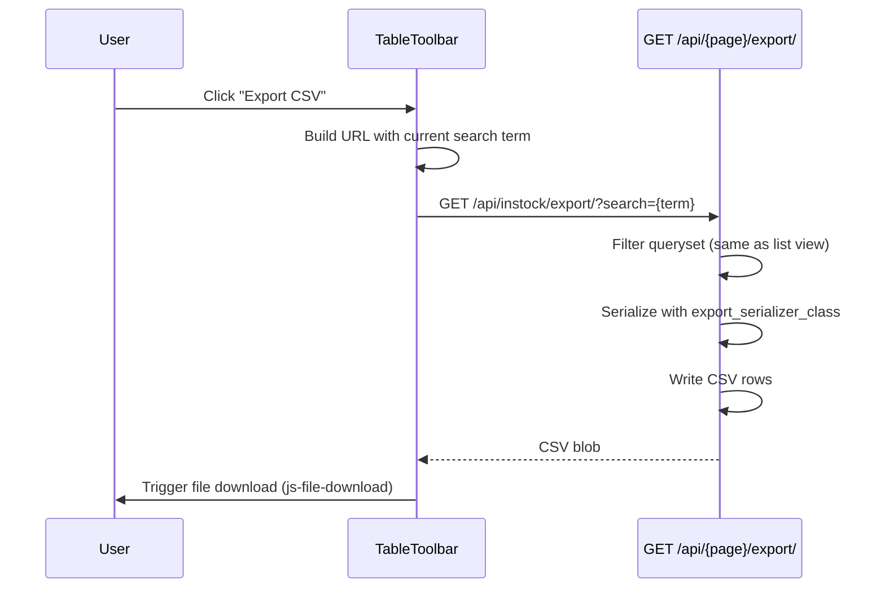

**Export serializers** use `SlugRelatedField` for FK fields — outputs human-readable names (e.g., item code, group name) instead of IDs.

---

## 10. Instock Update (Price Recalculation)

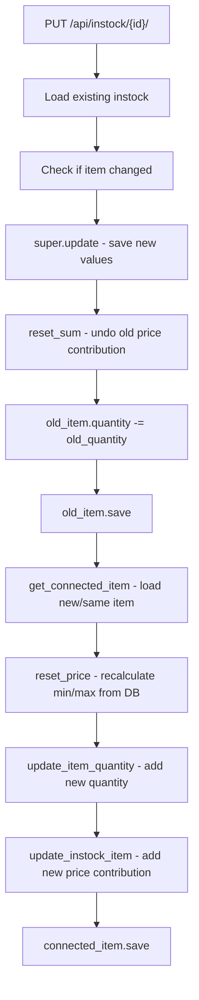

This handles the case where an instock record's item, quantity, or price changes — old contributions are reversed, then new ones applied.

---

## 11. Data Import (loadstock Command)

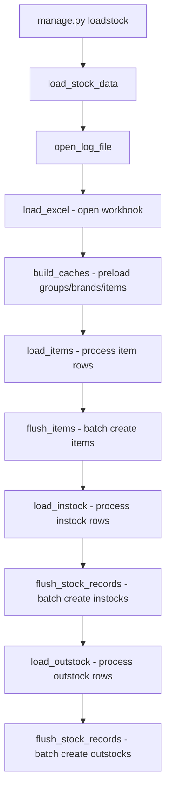

Uses `openpyxl` for Excel reading. Processes in batches with progress tracking (`save_progress`/`load_progress`).

---

## 12. Delete Behavior

All CRUD ViewSets inherit `ModelViewSet.destroy()` — DELETE requests are allowed for all managed resources (Group, Item, Instock, Outstock).

### Cascade Behavior

**All foreign keys use `on_delete=models.SET_NULL`** — no cascading deletes anywhere:

| Deleted Model | Effect on Related Records |
|---------------|--------------------------|
| Item | Instock/Outstock `.item` set to NULL (records preserved) |
| Group | Item `.group` set to NULL |
| Brand | Item `.brand` set to NULL |
| Customer | Outstock `.customer` set to NULL |
| Instock | No cascade (nothing references Instock via FK) |
| Outstock | No cascade (nothing references Outstock via FK) |

### Important: No Business Logic on Delete

Deleting an Instock or Outstock record does **NOT** reverse its quantity/price effects on the parent Item. For example:
- Deleting an Instock will NOT subtract its quantity from `item.quantity` or recalculate `sum_price`/`min_price`/`max_price`
- Deleting an Outstock will NOT restore its quantity to `item.quantity`

This means deletions can create data inconsistency in Item aggregate fields. The `reset_django_tables` management command with `--backup-only` is the safest way to handle bulk corrections.

### M2M Relations

Instock and Outstock have `ManyToManyField` to Job. Django automatically cleans up the join table entries when either side is deleted — no orphan records in the M2M through table.

---

## 13. Excel Import Format Specification (`loadstock`)

Import files are placed in `stockmanagement_bg/stockmanagement/static/stockmanagement/data/`.

The system currently imports two files configured in `load_stock_data()`:

| File | Item Sheet | Instock Sheet | Outstock Sheet | Store Type | Has Group Column |
|------|-----------|---------------|----------------|------------|------------------|
| `ACC_2026.xlsx` | TABLE ITEM | Instock | Outstock | accessory | No |
| `METAL_2026.xlsx` | Tableitem | Instock | Outstock. | metal | Yes |

### Item Sheet Columns

**With group column** (METAL):

| Col | Field | Required | Notes |
|-----|-------|----------|-------|
| A (0) | code | ✓ | SKU code, uppercased. Duplicates skipped |
| B (1) | group | | Group name — auto-created if missing |
| C (2) | description | | Item description |
| D (3) | brand | | Brand name — auto-created if missing |
| E (4) | unit | | Unit of measurement |
| F (5) | max_price | | Decimal — not used for initial import (calculated from instocks) |
| G (6) | min_price | | Decimal — not used for initial import |

**Without group column** (ACC):

| Col | Field | Required | Notes |
|-----|-------|----------|-------|
| A (0) | code | ✓ | SKU code, uppercased |
| B (1) | max_quanity | | Max quantity alert threshold |
| C (2) | min_quanity | | Min quantity alert threshold |
| D (3) | description | | |
| E (4) | brand | | Brand name — auto-created |
| F (5) | unit | | |
| G (6) | max_price | | |
| H (7) | min_price | | |

**Header row**: Row 1 (data starts at row 2)

### Instock Sheet Columns

| Col | Field | Required | Notes |
|-----|-------|----------|-------|
| A (0) | stock_date | | Date value |
| B (1) | invoice_id | ✓ | Invoice reference |
| C (2) | purchase_order_id | | PO reference |
| D (3) | job | | Job ID — auto-created in Job table if missing |
| E (4) | supplier | | Supplier name |
| F (5) | item (code) | ✓ | Must match existing Item.code (uppercased) |
| G (6) | quantity | | Decimal |
| H (7) | price | | Unit price (decimal) |

**Header row**: Row 1 (data starts at row 2)

**Side effects**: Updates Item aggregates — `quantity += qty`, `sum_price += price*qty`, `min_price`/`max_price` adjusted, `instock_number` incremented.

### Outstock Sheet Columns

| Col | Field | Required | Notes |
|-----|-------|----------|-------|
| A (0) | stock_date | | Date value |
| B (1) | job | ✓ | Job ID — auto-created if missing |
| C (2) | customer | | Customer name — auto-created if missing |
| D (3) | stock_id | | Stock reference ID |
| E (4) | requester | | Person requesting |
| F (5) | department | | Department name |
| G (6) | item (code) | ✓ | Must match existing Item.code (uppercased) |
| H (7) | quantity | | Decimal |

**Header row**: Configurable (`outstock_header_row`) — ACC=1, METAL=2. Data starts at `header_row + 2`.

**Side effects**: Updates Item — `quantity -= qty` (floored at 0), `outstock_number` incremented.

### Import Behavior

- **Batch processing**: Flushes every 200 rows
- **Progress tracking**: Saves to `data/progress.json` — supports resume on crash
- **Invalid rows**: Logged to `static/stockmanagement/invalid_*.csv`
- **Duplicate items**: Skipped (logged)
- **Missing items**: Instock/outstock rows referencing non-existent item codes are skipped (logged as CRIT)
- **Jobs**: Auto-created via `get_or_create` if not found. Handles Excel float artifacts (e.g., "123.0" → "123")
