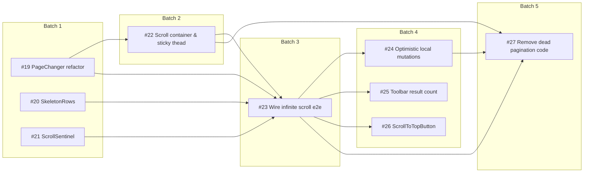

# Dependency Graph

```mermaid
graph LR
  subgraph "Batch 1"
    T19[#19 PageChanger refactor]
    T20[#20 SkeletonRows]
    T21[#21 ScrollSentinel]
  end
  subgraph "Batch 2"
    T22[#22 Scroll container & sticky thead]
  end
  subgraph "Batch 3"
    T23[#23 Wire infinite scroll e2e]
  end
  subgraph "Batch 4"
    T24[#24 Optimistic local mutations]
    T25[#25 Toolbar result count]
    T26[#26 ScrollToTopButton]
  end
  subgraph "Batch 5"
    T27[#27 Remove dead pagination code]
  end
  T19 --> T22
  T19 --> T23
  T20 --> T23
  T21 --> T23
  T22 --> T23
  T23 --> T24
  T23 --> T25
  T23 --> T26
  T22 --> T27
  T23 --> T27
  T24 --> T27
```
