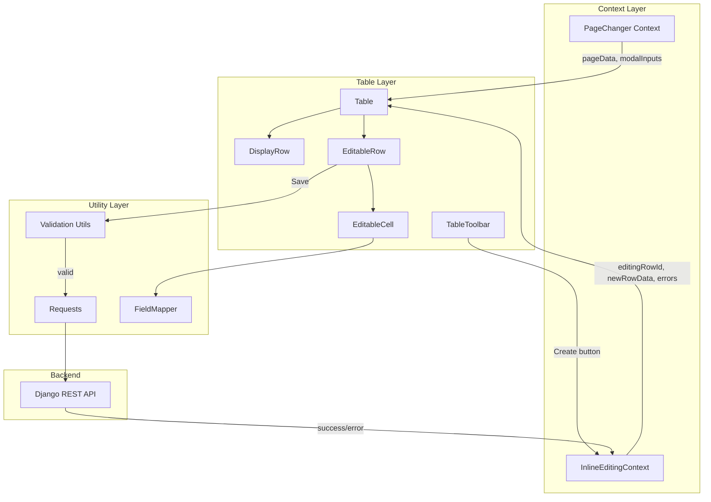
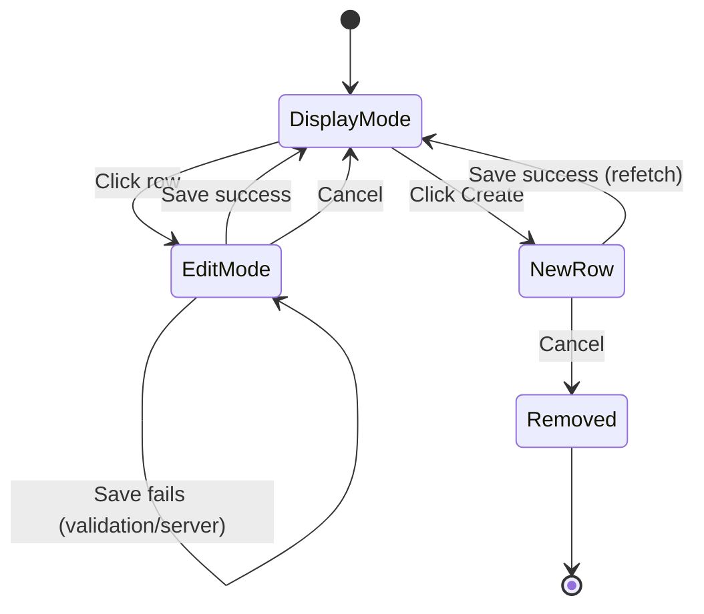

# Design Document: Inline Editing

## Overview

This design replaces the existing modal/popup-based record creation and editing system with inline Excel-style editing directly within table rows. The current flow uses `PopupContextManager` + `Popups.tsx` + `Forms.tsx` to open a Material UI `Dialog` for create/edit operations. The new system renders editable input controls directly inside table rows, eliminating context-switching and providing a spreadsheet-like experience.

Key design decisions:
- **New `InlineEditingContext`** replaces `PopupContextManager` for managing edit state (which row is editing, row data, validation errors)
- **`EditableRow` component** renders field-type-appropriate input controls inline within `<tr>` elements
- **Client-side validation** runs before API submission, with visual error indicators (red borders + tooltips)
- **Existing `Requests` utility** used for API calls (POST for create, PUT for update)
- **No new dependencies** — uses existing Tailwind, react-datepicker, and project patterns
- **Phase out MUI** Prefer using HTML and shadcn style components

## Architecture



### State Flow



## Components and Interfaces

### InlineEditingContext

Replaces `PopupContextManager` for inline editing state management.

```typescript
// src/pages/context/InlineEditingContext.tsx

type EditMode = 'none' | 'editing' | 'creating'

type ValidationErrors = {
    [fieldName: string]: string
}

type InlineEditingContextType = {
    editMode: EditMode
    editingRowId: number | null
    editingData: DataType
    validationErrors: ValidationErrors
    isSaving: boolean

    startEditing: (rowData: DataType) => void
    startCreating: () => void
    updateField: (fieldName: string, value: any) => void
    clearFieldError: (fieldName: string) => void
    save: (pageName: PageName, modalInputs: FieldsDataType) => Promise<void>
    cancel: () => void
    moveToOutstock: (rowData: DataType, changePageTo: ChangePageToType) => void
}
```

### EditableRow

Renders a table row in edit mode with input controls.

```typescript
// src/pages/table/EditableRow.tsx

type EditableRowProps = {
    modalInputs: FieldsDataType
    currentPageName: PageName
    isNewRow: boolean
}
```

### EditableCell

Renders a single editable cell with the appropriate input control based on field type.

```typescript
// src/pages/table/EditableCell.tsx

type EditableCellProps = {
    fieldName: string
    fieldType: string
    fieldChoices: string[]
    value: any
    error: string | undefined
    onChange: (fieldName: string, value: any) => void
    onKeyDown: (e: React.KeyboardEvent) => void
    inputRef: React.RefObject<HTMLInputElement | HTMLElement>
}
```

### FieldMapper Utility

Maps `FieldsDataType` entries to the correct input control type. Pure function, easily testable.

```typescript
// src/util/fieldMapper.ts

type InputControlType = 'text' | 'number' | 'decimal' | 'date' | 'select' | 'autocomplete' | 'hidden'

function mapFieldTypeToControl(fieldType: string): InputControlType

function getEditableFields(modalInputs: FieldsDataType): FieldsDataType
// Filters out AutoField entries, returns only user-editable fields
```

### Validation Utility

Client-side validation logic. Pure function, property-testable.

```typescript
// src/util/validation.ts

type ValidationResult = {
    isValid: boolean
    errors: ValidationErrors
}

function validateRow(
    rowData: DataType,
    modalInputs: FieldsDataType
): ValidationResult
// Checks required fields are non-empty, numeric fields are valid numbers, etc.

function formatValidationError(fieldName: string, reason: string): string
// Returns human-readable error message

function mapServerErrors(serverResponse: Record<string, string[]>): ValidationErrors
// Converts DRF error format { field: ["error1", "error2"] } to { field: "error1" }
```

### MoveToOutstock Utility

Extracts the correct field subset when moving an instock record to outstock.

```typescript
// src/util/moveToOutstock.ts

const OUTSTOCK_COPY_FIELDS = ['item', 'quantity', 'stock_date', 'notes', 'store_type', 'job']

function extractOutstockFields(instockData: DataType): DataType
// Returns a new object containing only the fields in OUTSTOCK_COPY_FIELDS
```

### Keyboard Navigation

```typescript
// src/util/keyboardNavigation.ts

type NavigationAction = 'next' | 'previous' | 'save' | 'cancel' | 'none'

function getNavigationAction(
    event: React.KeyboardEvent,
    currentIndex: number,
    totalFields: number
): NavigationAction
// Tab on non-last → next, Tab on last → stay (none), Shift+Tab on non-first → previous,
// Shift+Tab on first → stay (none), Enter on last → save, Enter on non-last → next, Escape → cancel
```

### Updated Table Component

The existing `Table.tsx` is modified to conditionally render `EditableRow` or `DisplayRow` based on `InlineEditingContext` state.

### Updated TableToolbar

The Create button calls `startCreating()` from `InlineEditingContext` instead of `openPopup()`. The button is disabled when `editMode === 'creating'`.

## Data Models

### Existing Types (unchanged)

```typescript
type PageName = "instock" | "outstock" | "item" | "group" | "log"
type DataType = { [key: string]: any }
type DataTypeArray = Array<DataType>
type FieldsDataType = FieldsDataTypeRow[]
type FieldsDataTypeRow = {
    fieldName: string
    fieldType: string
    fieldChoices: string[]
}
```

### New Types

```typescript
// ValidationErrors: maps field names to error messages
type ValidationErrors = { [fieldName: string]: string }

// EditMode: tracks current editing state
type EditMode = 'none' | 'editing' | 'creating'

// NavigationAction: result of keyboard event processing
type NavigationAction = 'next' | 'previous' | 'save' | 'cancel' | 'none'

// InputControlType: which input control to render
type InputControlType = 'text' | 'number' | 'decimal' | 'date' | 'select' | 'autocomplete' | 'hidden'
```

### API Request/Response Shapes

**Create (POST):** `POST /api/{pageName}/` with body `DataType` (excluding `id`). Returns created record as `DataType`.

**Update (PUT):** `PUT /api/{pageName}/{id}/` with body `DataType` (excluding `id`). Returns updated record as `DataType`.

**Validation Error Response (400):**
```json
{
    "field_name": ["Error message 1", "Error message 2"],
    "other_field": ["Required field"]
}
```

**Field Schema:** `GET /fields/{pageName}` returns `FieldsDataType` — array of `{ fieldName, fieldType, fieldChoices }`.

## Correctness Properties

*A property is a characteristic or behavior that should hold true across all valid executions of a system — essentially, a formal statement about what the system should do. Properties serve as the bridge between human-readable specifications and machine-verifiable correctness guarantees.*

### Property 1: Field schema to editable controls mapping

*For any* valid `FieldsDataType` array, the `getEditableFields` function SHALL return only entries where `fieldType` is not `'AutoField'`, and for each returned entry, `mapFieldTypeToControl` SHALL return the correct `InputControlType` (`'number'` for IntegerField, `'decimal'` for DecimalField, `'date'` for DateField, `'select'` for ChoiceField, `'autocomplete'` for ForeignKey, `'text'` for all others).

**Validates: Requirements 1.1, 1.2, 2.2**

### Property 2: Edit-cancel round trip preserves original data

*For any* valid `DataType` object representing a row's original data, if the row enters Edit_Mode with that data pre-filled, and then arbitrary field modifications are made, triggering the Cancel_Action SHALL produce a state where the displayed row data is deeply equal to the original `DataType` object.

**Validates: Requirements 2.1, 2.4**

### Property 3: Client-side validation correctly identifies invalid fields

*For any* `FieldsDataType` schema and *any* `DataType` row data where at least one required field (non-AutoField, non-ChoiceField-with-default) has an empty/null/undefined value, the `validateRow` function SHALL return `isValid: false` and the `errors` object SHALL contain an entry for every empty required field and SHALL NOT contain entries for fields that have valid values.

**Validates: Requirements 2.7, 3.1, 3.2, 4.4**

### Property 4: Server error response mapping

*For any* DRF-format error response object (mapping field names to arrays of error strings), the `mapServerErrors` function SHALL produce a `ValidationErrors` object where every field present in the server response has a corresponding non-empty error string, and no fields absent from the server response have error entries.

**Validates: Requirements 1.5, 2.8, 3.3, 3.4, 4.5**

### Property 5: Keyboard navigation focus management

*For any* row with N editable fields (N ≥ 1) and current focus at index i (0-based), the `getNavigationAction` function SHALL return: `'next'` when Tab is pressed and i < N-1, `'none'` when Tab is pressed and i = N-1, `'previous'` when Shift+Tab is pressed and i > 0, `'none'` when Shift+Tab is pressed and i = 0, `'save'` when Enter is pressed and i = N-1, `'next'` when Enter is pressed and i < N-1, and `'cancel'` when Escape is pressed regardless of i.

**Validates: Requirements 5.1, 5.2, 5.5, 5.6, 5.7, 5.4, 5.3**

### Property 6: Move-to-outstock field extraction

*For any* valid instock `DataType` object, the `extractOutstockFields` function SHALL return a new object containing exactly the keys `['item', 'quantity', 'stock_date', 'notes', 'store_type', 'job']` (where present in the source), with values identical to the source object, and SHALL NOT include any other keys (specifically not `id`, `invoice_id`, `price`, `purchase_order_id`, `supplier`, `quantity_left`).

**Validates: Requirements 7.2**

## Error Handling

| Scenario | Behavior |
|----------|----------|
| Client validation fails | Row stays in Edit_Mode, red borders + tooltips on invalid fields, no API call |
| Server returns 400 with field errors | Row stays in Edit_Mode, server error messages shown as tooltips on corresponding fields |
| Server returns 500 or network error | Row stays in Edit_Mode, generic error banner displayed above the row |
| User modifies an errored field | Error indicator cleared on that specific field only |
| Re-save after fixing some fields | All previous indicators cleared, re-validation runs fresh |

### Error Message Format

- **Required field empty:** `"{FieldName} is required"`
- **Invalid number:** `"{FieldName} must be a valid number"`
- **Server field error:** Display the first error string from the DRF response array verbatim
- **Network/generic error:** `"Save failed. Please check your connection and try again."`

## Testing Strategy

### Frontend: Property-Based Tests (fast-check)

The project already uses `fast-check` (v4.7.0) and `vitest` (v4.1.5). Each correctness property maps to a single property-based test with minimum 100 iterations.

| Property | Test File | What's Generated |
|----------|-----------|-----------------|
| 1: Field mapping | `fieldMapper.property.test.ts` | Random `FieldsDataType` arrays with mixed field types |
| 2: Edit-cancel round trip | `inlineEditing.property.test.ts` | Random `DataType` objects + random field modifications |
| 3: Validation | `validation.property.test.ts` | Random schemas + random row data with empty/filled fields |
| 4: Server error mapping | `validation.property.test.ts` | Random DRF error response objects |
| 5: Keyboard navigation | `keyboardNavigation.property.test.ts` | Random field counts (1-20) + random focus positions + random key events |
| 6: Move-to-outstock | `moveToOutstock.property.test.ts` | Random instock `DataType` objects with varying field sets |

**Configuration:**
- Minimum 100 iterations per property test (`{ numRuns: 100 }`)
- Each test tagged with: `// Feature: inline-editing, Property {N}: {title}`

### Frontend: Unit Tests (example-based)

- Create button disabled while New_Row present
- Save/Cancel buttons rendered in edit mode
- Escape key triggers cancel
- No dialog/modal elements in DOM during inline editing
- POST used for new rows, PUT used for existing rows
- Page data re-fetched after successful create

### Backend: Pytest + Hypothesis

The backend uses `pytest` with `pytest-django` and `hypothesis[django]` for property-based testing. Existing pattern in `stockmanagement/tests/` uses `hypothesis.extra.django.TestCase` with DRF's `APIRequestFactory`.

**Configuration:**
- `pytest.ini`: `DJANGO_SETTINGS_MODULE = stockmanagement_bg.settings`, `pythonpath = .`
- `conftest.py`: Custom `django_db_setup` fixture creates unmanaged tables (customer, job) before migrations
- `test_settings.py`: SQLite in-memory DB available for isolated tests
- Hypothesis settings: `max_examples=100`, `suppress_health_check=[too_slow, function_scoped_fixture]`, `deadline=None`

**Test file:** `stockmanagement/tests/test_inline_editing_api.py`

| Test | What's Verified |
|------|----------------|
| POST create with valid data returns 201 + created record | Requirement 4.1 |
| POST create with missing required fields returns 400 + field errors | Requirement 4.4, 4.5 |
| PUT update with valid data returns 200 + updated record | Requirement 4.2 |
| PUT update with invalid data returns 400 + field errors | Requirement 4.5 |
| Outstock quantity exceeding item quantity returns 400 | Requirement 7.4 |
| Fields endpoint returns correct schema for each page | Requirement 1.1, 2.2 |

**Property-based backend tests:**

| Property | Strategy | What's Verified |
|----------|----------|----------------|
| Create with arbitrary valid field combinations succeeds | `hypothesis.extra.django` model strategies | API always returns 201 for valid payloads |
| Create with any required field missing returns 400 with that field in errors | Random field omission from valid payload | DRF serializer validation is exhaustive |
| Outstock save never succeeds when quantity > item.quantity | Random quantities above threshold | Business rule enforced at API level |

**Pattern (matches existing `test_search_properties.py`):**

```python
# stockmanagement/tests/test_inline_editing_api.py

from hypothesis import given, settings, HealthCheck
from hypothesis import strategies as st
from hypothesis.extra.django import TestCase
from rest_framework.test import APIRequestFactory, force_authenticate

class TestCreateValidation(TestCase):
    """
    Feature: inline-editing, Property: Create with missing required field returns 400

    For any required field omitted from a valid payload, the create endpoint
    SHALL return 400 with that field name in the error response.
    """

    @settings(
        max_examples=100,
        suppress_health_check=[HealthCheck.too_slow, HealthCheck.function_scoped_fixture],
        deadline=None,
    )
    @given(field_to_omit=st.sampled_from(['item', 'quantity', 'stock_date']))
    def test_missing_required_field_returns_400(self, field_to_omit):
        # ... build valid payload, remove field_to_omit, POST, assert 400 + field in errors
        pass
```

### Integration Tests (Cypress)

- Full create flow: click Create → fill fields → Save → verify row appears
- Full edit flow: click row → modify field → Save → verify updated values
- Validation flow: leave required field empty → Save → verify red border + tooltip
- Move to outstock flow: edit instock row → Move to Outstock → verify outstock page with pre-filled row
- Keyboard navigation: Tab through fields, Enter to save, Escape to cancel

### Test Commands

```bash
# Frontend
cd stockmanagement-fe
npm run test              # Runs vitest (includes property tests)
npm run e2e:run           # Runs Cypress headless

# Backend
cd stockmanagement_bg
pytest                    # All backend tests (unit + property)
pytest -k inline_editing  # Only inline-editing tests
pytest --hypothesis-show-statistics  # Show Hypothesis stats
```
