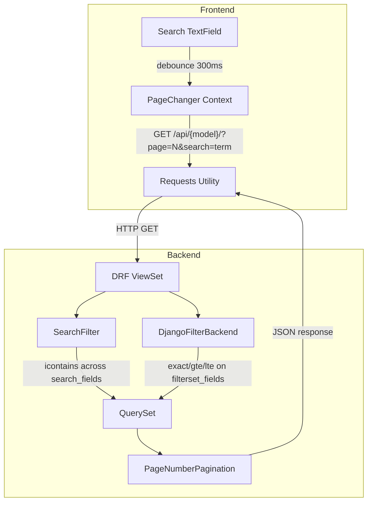

# Design Document: Search System

## Overview

This design replaces the broken legacy search (Axios-based suggestion endpoints with separator-based filter construction) with a standards-based approach: DRF's built-in `SearchFilter` on the backend and a simple debounced text input on the frontend. The architecture also installs `django-filter`'s `DjangoFilterBackend` alongside `SearchFilter` to enable future numeric/date filtering without a rewrite.

**Key design decisions:**
- Use DRF's `SearchFilter` rather than custom Q-object search logic — it's battle-tested, handles multi-word AND logic, related field traversal, and case-insensitive partial matching out of the box.
- Use `django-filter` for structured field filtering (numeric ranges, dates) — it integrates natively with DRF's filter backend system and coexists with `SearchFilter`.
- Frontend uses a single `TextField` with 300ms debounce — no autocomplete, no suggestion endpoints, no pill tags. The search term is managed as a single string in `PageChanger` context.
- The `Requests` utility class (native fetch wrapper) handles all HTTP calls — no Axios.

## Architecture



**Data flow:**
1. User types in search input → 300ms debounce fires
2. `PageChanger` context resets page to 1, stores search term
3. `Requests.get()` calls `/api/{model}/?page=1&search={encodeURIComponent(term)}`
4. DRF ViewSet applies `SearchFilter` (text search) + `DjangoFilterBackend` (numeric/date filters)
5. Paginated response returns to frontend → table updates

## Components and Interfaces

### Backend Components

#### `SearchableViewSetMixin` (new mixin on `FormDataMixin`)

Rather than modifying `FormDataMixin` directly, add `filter_backends`, `search_fields`, and `filterset_fields` to each ViewSet. DRF's `ModelViewSet` (which `FormDataMixin` extends) already supports these class attributes natively.

```python
# On each ViewSet class:
from rest_framework.filters import SearchFilter
from django_filters.rest_framework import DjangoFilterBackend

class ItemViewSet(FormDataMixin):
    filter_backends = [SearchFilter, DjangoFilterBackend]
    search_fields = ['name', 'code', 'description', 'unit', 'group__name', 'brand__name', 'notes']
    filterset_fields = {
        'quantity': ['exact', 'gte', 'lte'],
        'max_price': ['exact', 'gte', 'lte'],
        'min_price': ['exact', 'gte', 'lte'],
        'sum_price': ['exact', 'gte', 'lte'],
        'min_quanity': ['exact', 'gte', 'lte'],
        'max_quanity': ['exact', 'gte', 'lte'],
    }
```

**Important:** The existing `FormDataMixin.get_queryset()` applies manual filtering from query params. The `exclude_from_filters` list must be extended to include `search` (and any django-filter params) so they don't get passed to `.filter(**self.filters)` which would cause `FieldError`. The cleanest approach: override `get_queryset()` to only apply ordering, and let DRF's filter backends handle all filtering.

#### ViewSet search_fields Configuration

| ViewSet | search_fields |
|---------|--------------|
| `GroupViewSet` | `name`, `description` |
| `ItemViewSet` | `name`, `code`, `description`, `unit`, `group__name`, `brand__name`, `notes` |
| `InstockViewSet` | `invoice_id`, `purchase_order_id`, `supplier`, `item__name`, `store_type`, `notes` |
| `OutstockViewSet` | `stock_id`, `requester`, `department`, `item__name`, `customer__name`, `store_type`, `notes` |

#### ViewSet filterset_fields Configuration

| ViewSet | Numeric Fields | Date Fields |
|---------|---------------|-------------|
| `ItemViewSet` | quantity, max_price, min_price, sum_price, min_quanity, max_quanity | — |
| `InstockViewSet` | quantity, price | stock_date |
| `OutstockViewSet` | quantity, remaining_quantity | stock_date |
| `GroupViewSet` | — | — |

All numeric/date fields use lookups: `['exact', 'gte', 'lte']`

#### `FormDataMixin.get_queryset()` Modification

Current implementation applies `self.filters` (all non-page query params) as kwargs to `.filter()`. This conflicts with DRF filter backends which handle `search`, `quantity__gte`, etc. themselves.

**Solution:** Remove the manual filter logic from `get_queryset()`. Let DRF's filter backend pipeline handle filtering. The `get_queryset()` method should only return the base queryset with ordering:

```python
def get_queryset(self):
    return self.model.objects.all().order_by(self.order_by)
```

The `list()` method already calls `self.paginate_queryset(self.get_queryset())` — DRF's `filter_queryset()` is called automatically by `ModelViewSet.list()` when using the default implementation. Since `FormDataMixin` overrides `list()`, we need to call `self.filter_queryset()` explicitly:

```python
def list(self, request):
    queryset = self.filter_queryset(self.get_queryset())
    self.data = self.paginate_queryset(queryset)
    return self.get_paginated_response(self.view_serialized_data)
```

### Frontend Components

#### `Search` Component (rewrite of `src/pages/table/Search.tsx`)

**Props interface:**
```typescript
type SearchProps = {
    searchTerm: string
    onSearchChange: (term: string) => void
    resultCount: number
}
```

**Behavior:**
- Renders a single MUI `TextField` with `variant="outlined"`, `size="small"`, `placeholder="Search..."`
- Controlled input bound to local state
- On input change: update local state, debounce 300ms, then call `onSearchChange(trimmedValue)`
- Displays `"{resultCount} results"` text below/beside the input
- No Autocomplete, no PillTag, no FilterOptionType

#### `PageChanger` Context Modifications

**New state:**
```typescript
const [searchTerm, setSearchTerm] = useState<string>("")
```

**Modified `updateDataFor`:**
```typescript
const updateDataFor = async (pageName, pageNumber, search, active) => {
    let url = `${import.meta.env.VITE_BASE_URL}/api/${pageName}/?page=${pageNumber}`
    if (search.trim().length > 0) {
        url += `&search=${encodeURIComponent(search)}`
    }
    // ... existing fetch logic
}
```

**Modified `tableLoader.changePageTo`:**
```typescript
changePageTo(newPageName: PageName) {
    setIsPageLoadingTo(true)
    setSearchTerm("")  // Clear search on tab change
    pageNumberUpdater.changePageNumberToFirstPage()
    setCurrentPageNameTo(newPageName)
}
```

**New search handler:**
```typescript
function updateSearchTerm(term: string) {
    setIsPageLoadingTo(true)
    setSearchTerm(term)
    pageNumberUpdater.changePageNumberToFirstPage()
}
```

**Remove:** `searchFilters` state, `FilterOptionType` usage, `searchPageFor`, `removeSearchFilter` from context.

## Data Models

No new database models are introduced. The search system operates on existing models via DRF's filter backends.

**Query parameter contract:**

| Parameter | Type | Description |
|-----------|------|-------------|
| `page` | integer | Page number (existing) |
| `search` | string | Full-text search term (new) |
| `{field}__exact` | varies | Exact match filter (new, django-filter) |
| `{field}__gte` | varies | Greater-than-or-equal filter (new, django-filter) |
| `{field}__lte` | varies | Less-than-or-equal filter (new, django-filter) |

**Response format (unchanged):**
```json
{
    "count": 42,
    "next": "http://host/api/item/?page=2&search=term",
    "previous": null,
    "results": [...]
}
```

## Correctness Properties

*A property is a characteristic or behavior that should hold true across all valid executions of a system — essentially, a formal statement about what the system should do. Properties serve as the bridge between human-readable specifications and machine-verifiable correctness guarantees.*

### Property 1: Search results contain the search term

*For any* set of records in the database and *for any* non-empty search term, every record returned by the List_Endpoint with that search term SHALL contain the search term (case-insensitive) in at least one of its searchable fields.

**Validates: Requirements 1.2**

### Property 2: Multi-word search uses AND logic

*For any* set of records and *for any* search query containing multiple space-separated words, every record in the response SHALL contain ALL words (case-insensitive) across its searchable fields.

**Validates: Requirements 1.3**

### Property 3: Pagination structure preserved under search

*For any* search term that matches more than PAGE_SIZE records, the paginated response SHALL contain exactly PAGE_SIZE results, a `count` equal to the total matching records, and valid `next`/`previous` links.

**Validates: Requirements 1.5**

### Property 4: Whitespace-only search returns unfiltered results

*For any* string composed entirely of whitespace characters (including empty string), the List_Endpoint SHALL return the same result set as a request with no search parameter.

**Validates: Requirements 1.7**

### Property 5: Search term persists across page navigation

*For any* active search term and *for any* page number, the request URL constructed by PageChanger_Context SHALL include `search={encoded_term}` as a query parameter.

**Validates: Requirements 3.1**

### Property 6: New search resets pagination to page 1

*For any* current page number greater than 1, when a new search term is submitted, the next request SHALL use `page=1`.

**Validates: Requirements 3.2**

### Property 7: Search term is URL-encoded

*For any* search term containing characters outside the unreserved set (letters, digits, `-`, `_`, `.`, `~`), the URL SHALL contain the output of `encodeURIComponent(term)` rather than the raw term.

**Validates: Requirements 3.4**

### Property 8: Combined search and filter uses AND logic

*For any* search term and *for any* valid numeric/date filter parameter, the List_Endpoint SHALL return only records that satisfy BOTH the text search AND the filter constraint.

**Validates: Requirements 6.4, 6.5**

### Property 9: Invalid filter parameters are ignored

*For any* query parameter referencing a field not in `filterset_fields` or using a lookup not in the allowed list, the List_Endpoint SHALL ignore it and return results as if the parameter were not present.

**Validates: Requirements 6.6**

### Property 10: Adversarial search input cannot cause injection

*For any* search term containing SQL metacharacters (`'`, `"`, `;`, `--`, `%`, `_`, `OR`, `DROP`, `UNION`), XSS payloads (`<script>`, `alert(1)</script>`, `">`, event handlers) confirms they're treated as literal search text, not executed.

### ORM Field Traversal Restriction

DRF's `SearchFilter` only searches fields explicitly listed in `search_fields`. A user cannot inject field names via the `search` parameter to traverse arbitrary relations — the searchable fields are hardcoded on each ViewSet class.

`DjangoFilterBackend` similarly only allows filtering on fields defined in `filterset_fields`. Unknown parameters are silently ignored (Property 9).

## Error Handling

| Scenario | Backend Behavior | Frontend Behavior |
|----------|-----------------|-------------------|
| Invalid search param (whitespace only) | Returns unfiltered results (SearchFilter ignores empty) | Does not send request; shows unfiltered data |
| Search matches nothing | Returns `{"count": 0, "results": []}` | Shows empty table with "0 results" |
| Network failure (fetch rejection) | N/A | Preserves previous table data, preserves input, logs error, shows error message |
| HTTP 4xx/5xx response | Returns error response | Shows empty table, preserves input, dismisses loader, shows error message |
| Invalid filter param | Ignored by DjangoFilterBackend | N/A (future feature) |
| Unauthenticated request | Returns 401 | Handled by existing auth flow (redirect to login) |

**Frontend error handling strategy:**
- Wrap `Requests.get()` call in try/catch
- On HTTP error (non-2xx): set `pageData` to `[]`, stop loading, show error toast/message
- On network error (fetch rejection): keep existing `pageData`, stop loading, log to console, show error message
- In both cases: preserve `searchTerm` state so user doesn't lose their query

## Testing Strategy

### Backend Tests (Python/Django TestCase)

**Unit tests (example-based):**
- Verify `filter_backends` contains `SearchFilter` and `DjangoFilterBackend` on each ViewSet
- Verify `search_fields` matches expected list per ViewSet
- Verify `filterset_fields` matches expected dict per ViewSet
- Verify unauthenticated request returns 401
- Verify search with no matches returns empty paginated response
- Verify `SelectFieldSearch` view and URL are removed

**Property tests (hypothesis):**
- Library: `hypothesis` with `hypothesis[django]` extras
- Minimum 100 iterations per property
- Properties 1–4, 8–10 tested at the Django API level using DRF's `APIRequestFactory`
- Generate random model instances with `hypothesis` strategies, then assert search/filter correctness
- Property 10: uses adversarial string strategy (SQL metacharacters, XSS payloads, ORM traversal strings) — asserts no 500 errors, no data leakage outside `search_fields`

**Tag format:** `Feature: search-system, Property {N}: {property_text}`

### Frontend Tests (Vitest + React Testing Library)

**Unit tests (example-based):**
- Search component renders TextField with correct MUI props
- Debounce fires after 300ms, not before
- Loading state set on search, cleared on response/error
- Result count displayed from API response
- Clear input resets search and fetches page 1
- Error scenarios: network failure preserves data, HTTP error shows empty table
- No axios imports, no legacy type references

**Property tests (fast-check):**
- Library: `fast-check`
- Minimum 100 iterations per property
- Properties 5–7 tested at the context/URL-construction level
- Generate random search terms, verify URL encoding and param persistence

**Tag format:** `Feature: search-system, Property {N}: {property_text}`

### E2E Tests (Cypress — existing setup)

- Search input visible on each table page
- Type search term → table filters after debounce
- Clear search → table shows all records
- Pagination works with active search
- Tab change clears search input

### Dependencies to Install

**Backend:**
- `django-filter>=23.0` (add to `requirements.txt`)
- `hypothesis` + `hypothesis[django]` (dev dependency for property tests)

**Frontend:**
- `fast-check` (dev dependency for property tests)
- `@testing-library/react` + `vitest` (dev dependencies if not already present)
